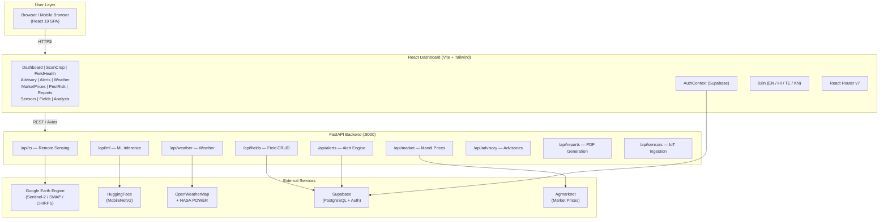
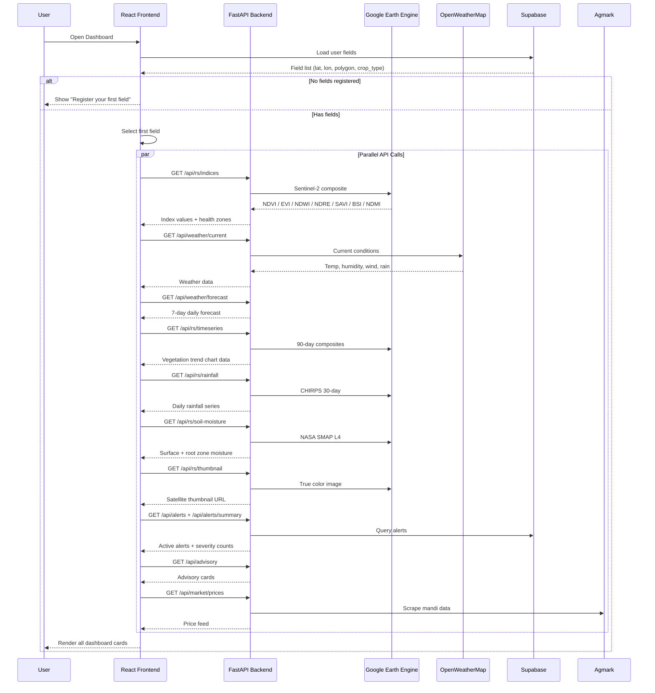
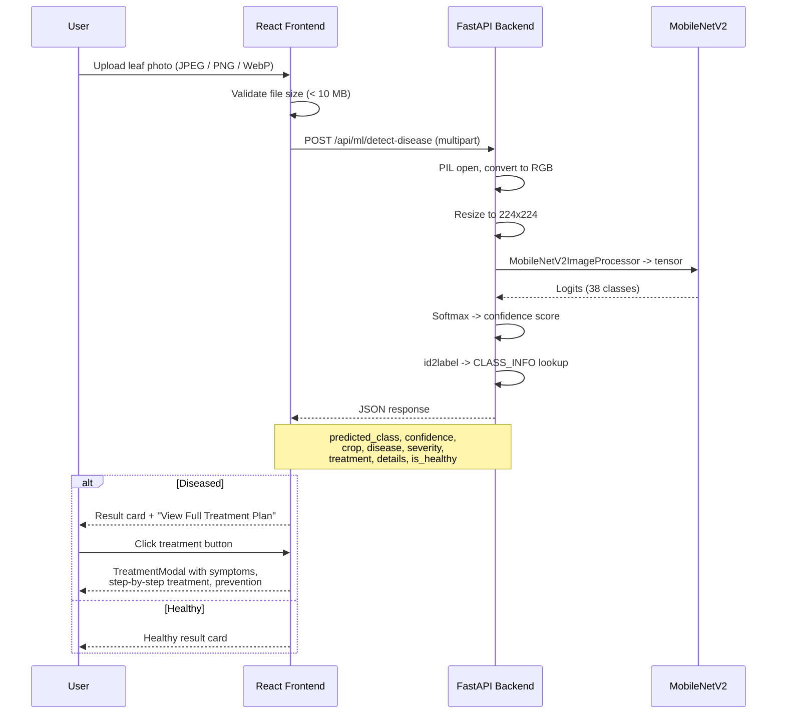
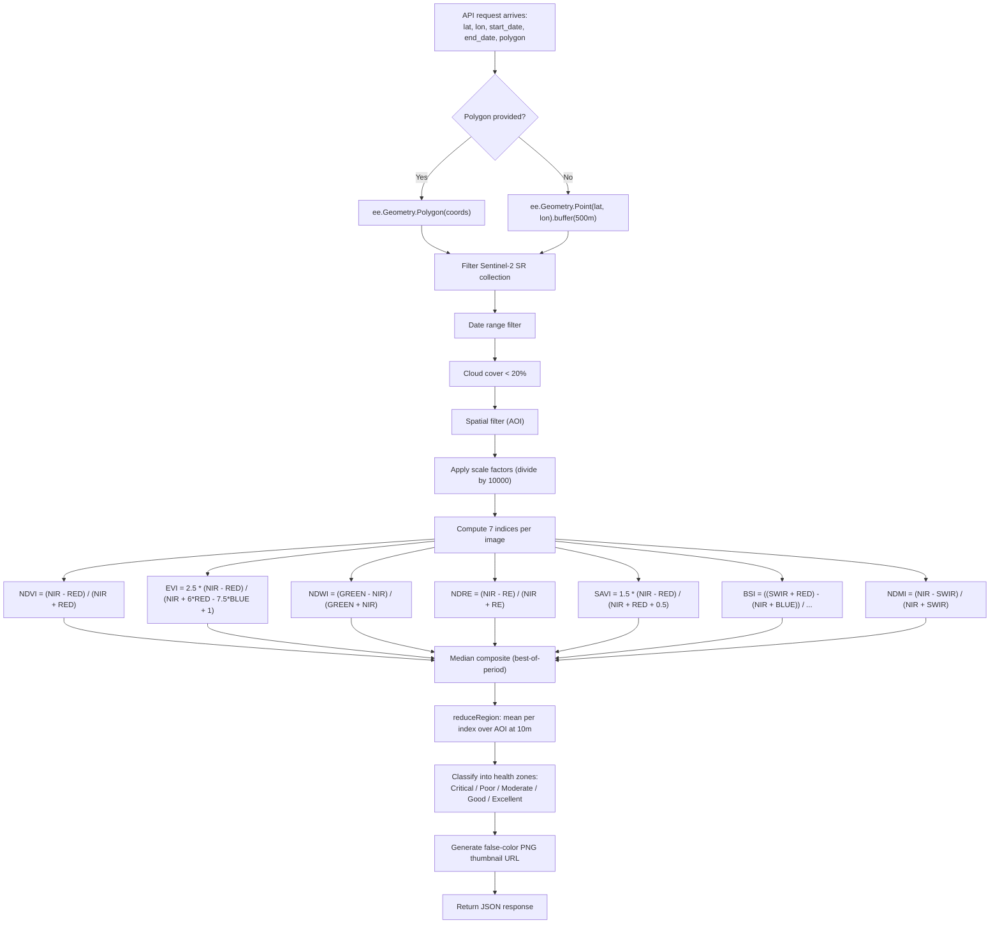
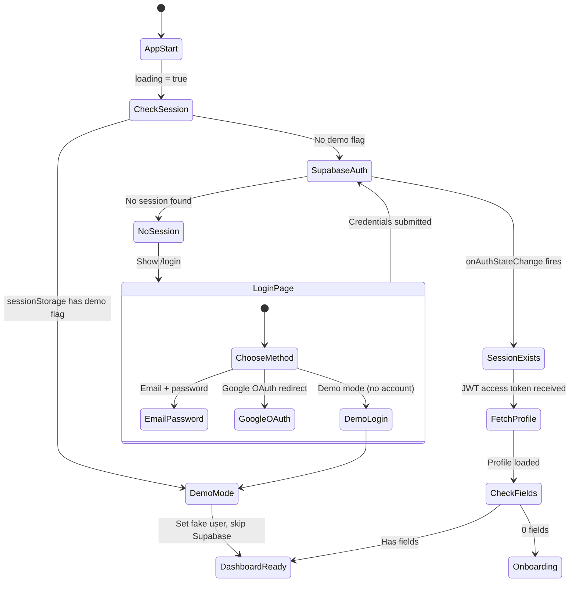
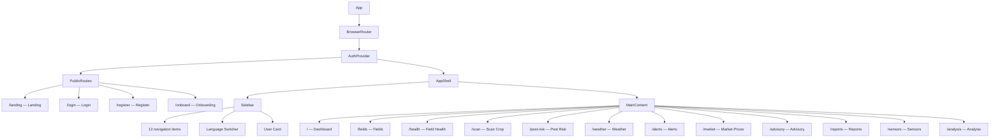

# Croppy

**AI-powered precision agriculture platform for Indian farmers.**

Croppy combines Sentinel-2 satellite imagery, deep learning disease detection, IoT sensor ingestion, and real-time market data into a single dashboard. Farmers register their fields, draw boundaries on a map, and instantly receive vegetation health indices computed from space, weather forecasts, pest risk scores, crop advisories, and mandi price feeds.

---

## What the Platform Does

Croppy serves three core functions:

1. **Satellite-based field monitoring.** Every registered field is analysed through Google Earth Engine. Sentinel-2 imagery is filtered, composited, and reduced to seven spectral vegetation indices (NDVI, EVI, NDWI, NDRE, SAVI, BSI, NDMI). These indices are classified into health zones ranging from Critical to Excellent and displayed on the dashboard alongside true-color satellite thumbnails, 90-day vegetation trend charts, CHIRPS rainfall data, and NASA SMAP soil moisture readings.

2. **AI crop disease detection.** A farmer photographs a leaf, uploads the image, and receives a diagnosis within 300 milliseconds. A MobileNetV2 model fine-tuned on the PlantVillage dataset classifies the image into one of 38 disease classes across 14 crop types. The response includes severity, a step-by-step treatment plan, symptoms, and prevention advice.

3. **Decision support.** The platform aggregates weather forecasts (OpenWeatherMap and NASA POWER), LSTM-based 7-day stress forecasts, rule-based pest risk scoring, crop growth stage tracking, advisory card generation, Agmarknet mandi price feeds, and an automated alert system into actionable recommendations.

---

## System Architecture



---

## Data Flow: Dashboard Load

When a user opens the dashboard, the frontend loads their registered fields from Supabase, selects the first field, and fires eleven parallel API calls to populate every card on the screen.



---

## Data Flow: Disease Detection



---

## Data Flow: Satellite Index Pipeline



---

## Data Flow: Authentication



---

## Feature List

| Feature | Data Source |
|---|---|
| NDVI / EVI / NDWI / NDRE / SAVI / BSI / NDMI vegetation maps | Google Earth Engine (Sentinel-2 SR) |
| True color satellite imagery | Google Earth Engine (Sentinel-2 SR) |
| 90-day vegetation trend time series | Google Earth Engine compositing |
| CNN crop disease detection (38 classes, 14 crops) | HuggingFace MobileNetV2 on PlantVillage |
| LSTM 7-day stress forecast | Custom PyTorch LSTM model |
| Rule-based pest risk scoring | Weather + NDVI rule engine |
| Current weather + 7-day forecast | OpenWeatherMap API |
| NASA SMAP soil moisture (surface + root zone) | Google Earth Engine (SMAP L4) |
| CHIRPS 30-day rainfall series | Google Earth Engine (CHIRPS Daily) |
| Agmarknet mandi price feed | Agmarknet scrape |
| IoT sensor data ingestion (JSON) | REST endpoint |
| Automated alert system (NDVI drop, water stress, heat, fungal risk) | Rule engine |
| PDF farm report generation | ReportLab |
| Crop growth stage tracker | Calendar-based computation |
| Multi-language UI (English, Hindi, Telugu, Kannada) | i18next |
| Google OAuth + email authentication | Supabase Auth |
| Field polygon drawing on map | Leaflet Draw |

---

## ML Models

### CNN Disease Detection (MobileNetV2)

| Property | Value |
|---|---|
| Model | linkanjarad/mobilenet_v2_1.0_224-plant-disease-identification |
| Source | HuggingFace Hub |
| Training data | PlantVillage (54,305 images, 38 classes) |
| Input | 224 x 224 RGB image |
| Output | 38-class probability distribution |
| Inference time | ~300ms on CPU |
| Local cache | ./ml_models/disease_hf/ |

Supported crops and diseases:

| Crop | Diseases |
|---|---|
| Apple | Scab, Black Rot, Cedar Rust, Healthy |
| Blueberry | Healthy |
| Cherry | Powdery Mildew, Healthy |
| Corn | Cercospora Leaf Spot, Common Rust, Northern Leaf Blight, Healthy |
| Grape | Black Rot, Esca (Black Measles), Isariopsis Leaf Spot, Healthy |
| Orange | Citrus Greening (HLB) |
| Peach | Bacterial Spot, Healthy |
| Pepper | Bacterial Spot, Healthy |
| Potato | Early Blight, Late Blight, Healthy |
| Raspberry | Healthy |
| Soybean | Healthy |
| Squash | Powdery Mildew |
| Strawberry | Leaf Scorch, Healthy |
| Tomato | Bacterial Spot, Early Blight, Late Blight, Leaf Mold, Septoria, Spider Mites, Target Spot, TYLCV, Mosaic Virus, Healthy |

### LSTM Stress Forecast

| Property | Value |
|---|---|
| Architecture | LSTM (sequence-to-one) |
| Input | 7-day window of NDVI values + weather features |
| Output | 7-day stress probability forecast |
| Training scripts | ml_training/ directory |

---

## Directory Structure

```
croppy/
|
|-- backend/                        Python FastAPI backend
|   |-- core/
|   |   |-- config.py               Environment variable loading
|   |   |-- auth.py                 JWT verification via Supabase
|   |   |-- supabase_client.py      Supabase service-role client
|   |
|   |-- routes/                     HTTP route handlers (one file per domain)
|   |   |-- rs.py                   Remote sensing endpoints
|   |   |-- ml.py                   Disease detection + LSTM
|   |   |-- fields.py               Field CRUD
|   |   |-- weather.py              Weather + forecast
|   |   |-- alerts.py               Alert list + acknowledge
|   |   |-- advisory.py             Advisory card generation
|   |   |-- market.py               Mandi price feed
|   |   |-- sensors.py              IoT sensor ingestion
|   |   |-- reports.py              PDF report generation
|   |   |-- onboarding.py           First-field setup flow
|   |   |-- insurance.py            Insurance helpers
|   |   |-- auth.py                 Email confirm (dev helper)
|   |
|   |-- services/                   Business logic layer
|   |   |-- gee_service.py          All Google Earth Engine calls
|   |   |-- disease_detection.py    CNN inference pipeline
|   |   |-- lstm_service.py         LSTM forecast service
|   |   |-- advisory_service.py     Rule engine for advisories
|   |   |-- auto_alerts.py          Alert trigger rules
|   |   |-- pest_risk.py            Pest risk scoring
|   |   |-- weather_service.py      OWM + NASA POWER calls
|   |   |-- soilgrids_service.py    SoilGrids API calls
|   |
|   |-- models/
|       |-- schemas.py              Pydantic request/response models
|
|-- dashboard/                      React 19 frontend
|   |-- src/
|   |   |-- components/             Shared UI (Sidebar, Gallery, etc.)
|   |   |-- contexts/               AuthContext (Supabase auth state)
|   |   |-- pages/
|   |   |   |-- Dashboard.jsx       Main analytics dashboard
|   |   |   |-- ScanCrop.jsx        Disease detection + treatment modal
|   |   |   |-- Landing.jsx         Public marketing page
|   |   |   |-- Login.jsx           Auth page
|   |   |   |-- FieldHealth.jsx     Per-field index deep dive
|   |   |   |-- Fields.jsx          Field CRUD + polygon drawing
|   |   |   |-- Weather.jsx         Detailed weather view
|   |   |   |-- Advisory.jsx        Full advisory + stage calendar
|   |   |   |-- Alerts.jsx          Alert management
|   |   |   |-- MarketPrices.jsx    Mandi price feed
|   |   |   |-- PestRisk.jsx        Pest risk scoring
|   |   |   |-- Reports.jsx         PDF report download
|   |   |   |-- Sensors.jsx         IoT sensor data view
|   |   |   |-- Analysis.jsx        Historical analysis
|   |   |-- utils/
|   |   |   |-- api.js              Axios wrappers for all API calls
|   |   |   |-- supabase.js         Supabase client init
|   |   |-- i18n.js                 i18next config (EN / HI / TE / KN)
|   |   |-- main.jsx                React entry point
|   |-- package.json
|
|-- ml_models/                      Model weights (gitignored)
|   |-- disease_hf/                 MobileNetV2 cached from HuggingFace
|
|-- ml_training/                    Training scripts and notebooks
|-- tests/                          pytest test suite
|-- requirements.txt                Python dependencies
|-- docker-compose.yml              Full stack Docker setup
|-- Dockerfile.backend              Backend container
|-- supabase_schema.sql             Database schema definition
|-- .env                            Environment variables (never commit)
```

---

## Tech Stack

### Backend

| Layer | Technology | Version |
|---|---|---|
| Web framework | FastAPI | 0.111.0 |
| ASGI server | Uvicorn | 0.29.0 |
| Satellite data | Google Earth Engine API | 0.1.409 |
| CNN inference | PyTorch + HuggingFace Transformers | latest |
| LSTM forecasting | PyTorch | latest |
| Image processing | Pillow | latest |
| ML utilities | scikit-learn | latest |
| HTTP client | httpx | 0.27.0 |
| Database and Auth | Supabase (PostgreSQL) | 2.5.0 |
| PDF generation | ReportLab | 4.4.10 |
| Validation | Pydantic | 2.7.1 |
| Config | python-dotenv | 1.0.1 |

### Frontend

| Layer | Technology | Version |
|---|---|---|
| Framework | React | 19.2.0 |
| Build tool | Vite | 7.3.1 |
| Routing | React Router | 7.13.1 |
| Auth | Supabase JS | 2.99.1 |
| HTTP | Axios | 1.13.6 |
| Maps | Leaflet + React-Leaflet | 1.9.4 / 5.0.0 |
| Charts | Recharts | 3.8.0 |
| Styling | Tailwind CSS | 4.2.1 |
| Icons | Lucide React | 0.577.0 |
| i18n | i18next + react-i18next | 25.8.18 / 16.5.8 |
| Animations | Motion | 12.35.2 |
| Notifications | React Hot Toast | 2.6.0 |

### Infrastructure

| Service | Role |
|---|---|
| Supabase | PostgreSQL database, Auth, Row Level Security |
| Google Earth Engine | Satellite imagery computation |
| OpenWeatherMap | Current weather + 7-day forecast |
| NASA POWER / SMAP | Soil moisture satellite data |
| CHIRPS | Rainfall satellite data |
| Agmarknet | Indian commodity market prices |
| HuggingFace Hub | MobileNetV2 model weights |
| Redis | Cache layer (future Celery task queue) |
| Docker | Containerised deployment |

---

## Database Schema

```sql
-- User profiles (extends Supabase auth.users)
CREATE TABLE profiles (
  id          UUID PRIMARY KEY REFERENCES auth.users(id),
  name        TEXT,
  role        TEXT DEFAULT 'farmer',     -- farmer | agronomist | admin
  language    TEXT DEFAULT 'en',         -- en | hi | te | kn
  phone       TEXT,
  state       TEXT,
  district    TEXT,
  created_at  TIMESTAMPTZ DEFAULT now()
);

-- Farm fields
CREATE TABLE fields (
  id          UUID PRIMARY KEY DEFAULT gen_random_uuid(),
  user_id     UUID REFERENCES profiles(id) ON DELETE CASCADE,
  name        TEXT NOT NULL,
  crop_type   TEXT NOT NULL,
  lat         FLOAT NOT NULL,
  lon         FLOAT NOT NULL,
  area_ha     FLOAT,
  state       TEXT,
  district    TEXT,
  polygon     JSONB,                     -- [[lat, lon], ...] boundary points
  sowing_date DATE,
  created_at  TIMESTAMPTZ DEFAULT now()
);

-- IoT sensor readings
CREATE TABLE sensor_readings (
  id              UUID PRIMARY KEY DEFAULT gen_random_uuid(),
  field_id        UUID REFERENCES fields(id) ON DELETE CASCADE,
  temperature_c   FLOAT,
  humidity_pct    FLOAT,
  soil_moisture   FLOAT,
  rainfall_mm     FLOAT,
  recorded_at     TIMESTAMPTZ DEFAULT now()
);

-- Auto-generated and manual alerts
CREATE TABLE alerts (
  id            UUID PRIMARY KEY DEFAULT gen_random_uuid(),
  user_id       UUID REFERENCES profiles(id) ON DELETE CASCADE,
  field_id      UUID REFERENCES fields(id),
  alert_type    TEXT,                    -- ndvi_drop | water_stress | heat_stress | fungal_risk
  severity      TEXT,                    -- high | medium | low
  message       TEXT,
  acknowledged  BOOLEAN DEFAULT false,
  created_at    TIMESTAMPTZ DEFAULT now()
);
```

Row Level Security is enabled on all tables. Users can only read and write their own rows.

---

## Frontend Architecture



### State Management

Global state is managed through React Context. The `AuthContext` holds the Supabase user object, profile row, authentication status, demo mode flag, loading state, and methods for sign-in, sign-up, sign-out, and token retrieval. Each page manages its own data fetching and loading states independently using local `useState` hooks.

---

## Prerequisites

| Requirement | Minimum Version | Notes |
|---|---|---|
| Python | 3.11+ | Backend runtime |
| Node.js | 18+ | Frontend build |
| npm | 9+ | Package manager |
| Git | any | Version control |
| Google Earth Engine account | - | Free at earthengine.google.com |
| Supabase project | - | Free tier at supabase.com |
| OpenWeatherMap API key | - | Free tier at openweathermap.org |

---

## Installation

### 1. Clone the repository

```bash
git clone https://github.com/your-org/croppy.git
cd croppy
```

### 2. Backend setup

```bash
python -m venv venv

# Windows
venv\Scripts\activate

# macOS / Linux
source venv/bin/activate

pip install -r requirements.txt

# Install PyTorch CPU build
pip install torch torchvision --index-url https://download.pytorch.org/whl/cpu
```

### 3. Frontend setup

```bash
cd dashboard
npm install
cd ..
```

### 4. Authenticate with Google Earth Engine

```bash
python -c "import ee; ee.Authenticate()"
# Follow the browser prompt, paste the token back into the terminal.
# Credentials are saved to ~/.config/earthengine/
```

### 5. Database setup

Open the Supabase SQL Editor, paste the contents of `supabase_schema.sql`, and run. This creates the `profiles`, `fields`, `sensor_readings`, and `alerts` tables with Row Level Security enabled.

---

## Environment Variables

Create a `.env` file in the project root:

```env
# Google Earth Engine
GEE_PROJECT_ID=your-gee-project-id

# OpenWeatherMap
OPENWEATHER_API_KEY=your-openweathermap-api-key

# Supabase (server-side, never expose to frontend)
SUPABASE_URL=https://your-project-id.supabase.co
SUPABASE_SERVICE_KEY=your-service-role-key
SUPABASE_JWT_SECRET=your-jwt-secret

# ML Model paths
MODEL_PATH=./ml_models/disease_model.h5
TFLITE_MODEL_PATH=./ml_models/disease_model.tflite
```

Create a `dashboard/.env` file for the frontend:

```env
# Supabase (public keys, safe for browser)
VITE_SUPABASE_URL=https://your-project-id.supabase.co
VITE_SUPABASE_ANON_KEY=your-anon-public-key

# Backend API URL
VITE_API_URL=http://localhost:8000
```

Never commit `.env` files. The `.gitignore` already excludes them.

---

## Running the App

### Development (two terminals)

Terminal 1 (backend):

```bash
uvicorn backend.main:app --reload --port 8000
```

The API will be live at `http://localhost:8000`. Swagger docs are at `/docs` and ReDoc at `/redoc`.

Terminal 2 (frontend):

```bash
cd dashboard
npm run dev
```

The dashboard will be live at `http://localhost:5173`.

### Production build

```bash
cd dashboard
npm run build
# Output goes to dashboard/dist/

uvicorn backend.main:app --host 0.0.0.0 --port 8000 --workers 4
```

---

## Docker Deployment

```bash
# Build and start all services
docker-compose up --build

# Run in background
docker-compose up -d --build

# Stop
docker-compose down

# View logs
docker-compose logs -f backend
docker-compose logs -f dashboard
```

| Service | Container Port | Host Port |
|---|---|---|
| FastAPI backend | 8000 | 8000 |
| React dashboard (nginx) | 80 | 3000 |
| Redis | 6379 | 6379 |

The backend container includes a health check at `GET /health` that returns `{ "status": "ok" }`. The container restarts automatically if it becomes unhealthy.

---

## API Reference

Full interactive documentation is available at `http://localhost:8000/docs` (Swagger UI).

### Remote Sensing (`/api/rs/`)

| Method | Endpoint | Description |
|---|---|---|
| GET | /api/rs/indices | Compute all vegetation indices for a field |
| GET | /api/rs/timeseries | 90-day NDVI/EVI/NDWI/NDRE time series |
| GET | /api/rs/thumbnail | True color Sentinel-2 image URL |
| GET | /api/rs/index-thumbnail | False-color spectral index image URL |
| GET | /api/rs/rainfall | 30-day CHIRPS daily rainfall |
| GET | /api/rs/soil-moisture | NASA SMAP surface + root zone moisture |

### Machine Learning (`/api/ml/`)

| Method | Endpoint | Description |
|---|---|---|
| POST | /api/ml/detect-disease | CNN inference on uploaded leaf image |
| POST | /api/ml/forecast | LSTM 7-day stress forecast |
| GET | /api/ml/yield-estimate | Yield estimation from indices |

### Fields (`/api/fields/`)

| Method | Endpoint | Description |
|---|---|---|
| GET | /api/fields/ | List user's fields |
| POST | /api/fields/ | Create a new field |
| GET | /api/fields/{id} | Get single field |
| PUT | /api/fields/{id} | Update field |
| DELETE | /api/fields/{id} | Delete field |

### Weather (`/api/weather/`)

| Method | Endpoint | Description |
|---|---|---|
| GET | /api/weather/current | Current conditions (OWM) |
| GET | /api/weather/forecast | 7-day daily forecast (OWM) |
| GET | /api/weather/nasa-power | Historical climate (NASA POWER) |

### Alerts (`/api/alerts/`)

| Method | Endpoint | Description |
|---|---|---|
| GET | /api/alerts/ | List active alerts |
| POST | /api/alerts/ | Create manual alert |
| GET | /api/alerts/summary | Count by severity |
| POST | /api/alerts/{id}/ack | Acknowledge an alert |

### Market (`/api/market/`)

| Method | Endpoint | Description |
|---|---|---|
| GET | /api/market/prices | Mandi prices for a crop type |

### Advisory (`/api/advisory/`)

| Method | Endpoint | Description |
|---|---|---|
| GET | /api/advisory/ | Generate advisory cards for a field |
| GET | /api/advisory/growth-stage | Crop growth stage for given sowing date |

### Reports (`/api/reports/`)

| Method | Endpoint | Description |
|---|---|---|
| POST | /api/reports/generate | Generate PDF farm report |
| GET | /api/reports/ | List generated reports |
| GET | /api/reports/{id}/download | Download PDF |

### Sensors (`/api/sensors/`)

| Method | Endpoint | Description |
|---|---|---|
| POST | /api/sensors/ingest | Ingest IoT sensor reading |
| GET | /api/sensors/ | List sensor readings |

---

## Satellite Data Sources

### Sentinel-2 (Vegetation Indices)

The platform uses the Sentinel-2 Surface Reflectance collection from Google Earth Engine. Images are filtered by date range, cloud cover (below 20%), and spatial bounds. After applying scale factors, seven spectral indices are computed per image, then a median composite produces the best-of-period values. The `reduceRegion` operation extracts mean values at 10-meter resolution over the field boundary.

### NASA SMAP (Soil Moisture)

NASA SMAP L4 Global Daily data at 9km resolution provides surface moisture (0 to 5 cm) and subsurface root zone moisture (5 to 50 cm) as volumetric water content. Accessed via Google Earth Engine collection `NASA/SMAP/SPL4SMGP/007`.

### CHIRPS (Rainfall)

Climate Hazards Group InfraRed Precipitation with Station data provides daily precipitation in mm/day. The platform retrieves a 30-day daily time series from Google Earth Engine collection `UCSB-CHG/CHIRPS/DAILY`.

---

## Running Tests

```bash
# Backend tests
pytest tests/ -v

# Test a specific module
pytest tests/test_api.py -v
pytest tests/test_ml.py -v

# Frontend lint
cd dashboard
npm run lint
```

---

## Troubleshooting

| Problem | Solution |
|---|---|
| `ee.EEException: Please authorize access` | Run `python -c "import ee; ee.Authenticate()"` |
| `OPENWEATHER_API_KEY not set` | Add key to `.env` and restart backend |
| Disease model downloads on first run | Expected behavior. ~14 MB cached to `./ml_models/disease_hf/` |
| Supabase 401 on API calls | Check `SUPABASE_SERVICE_KEY` in `.env` |
| CORS error in browser | Ensure backend is running on port 8000 |
| Map tiles not loading | Check internet connection. Esri satellite tiles require no API key |
| `vite: command not found` | Run `npm install` inside `dashboard/` first |

---

## License

This project is proprietary. See LICENSE for details.
